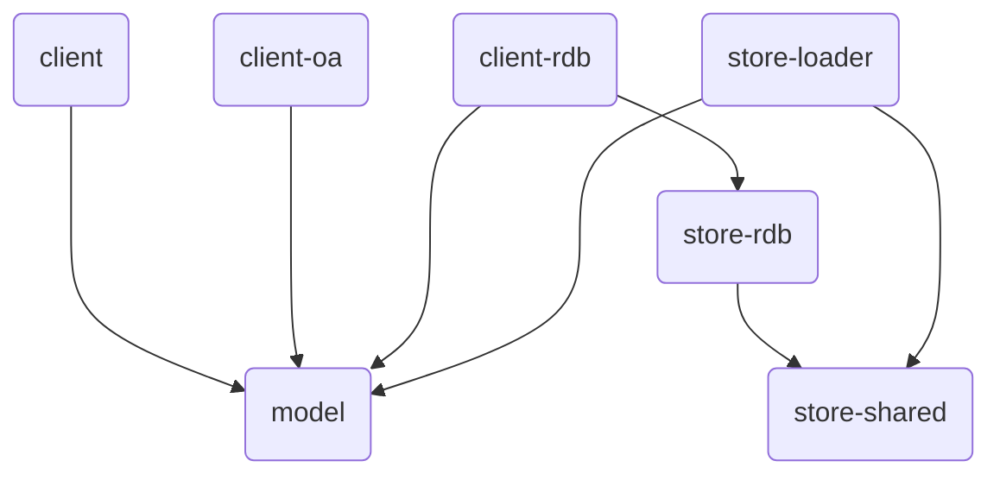

[](https://github.com/giis-uniovi/tdrules/actions)
[](https://sonarcloud.io/summary/new_code?id=my%3Atdrules)
[](https://giis-uniovi.github.io/tdrules/junit-noframes/junit-noframes.html)
[-orange)](https://giis-uniovi.github.io/tdrules/junit-frames/index.html)
[](https://central.sonatype.com/artifact/io.github.giis-uniovi/tdrules-bom)
[](https://www.nuget.org/packages/TdRules/)

# TdRules - Test Data Coverage Evaluation

This repository contains a set of components to generate *Full Predicate Coverage Rules* and *SQL Mutants*
to assess the coverage of the test data in relation to a query and load test data:

- Generate the FPC Rules and SQL Mutants ([TdRules Service](https://in2test.lsi.uniovi.es/tdrules/)).
- Discover the data store schema from an OpenApi specification or from a JDBC connection to a relational database.
- Models to manipulate the rules (both FPC Rules or SQL Mutants) and the schema.
- Load test data through a REST API or a JDBC connection.
- Available for Java 8 and higher, and .NET (netstandard 2.0).

NOTE: The name *TdRules* (Test Data Rules) is replacing the former *SQLRules* 
to enable generation of rules for data stores other than relational databases.

## Quick Start

- On Java, include the client API dependencies
[tdrules-client](https://central.sonatype.com/artifact/io.github.giis-uniovi/tdrules-client)
and either 
[tdrules-client-oa](https://central.sonatype.com/artifact/io.github.giis-uniovi/tdrules-client-oa)
or
[tdrules-client-rdb](https://central.sonatype.com/artifact/io.github.giis-uniovi/tdrules-client-rdb)
that are available in Maven Central.
A bom is also available:
[tdrules-bom](https://central.sonatype.com/artifact/io.github.giis-uniovi/tdrules-bom).

- On .NET, include the `TdRules` package
[TdRules](https://www.nuget.org/packages/TdRules/)
available in NuGet.

**Example:** To generate the FPC Rules for a query (`query`)
that executes against 
an OpenApi schema specification indicated by file or url (`spec`)
or a relational database that can be reached by an open JDBC Connection (`conn`),
you first get the data store schema model and then the rules model as follows:

<details open><summary><strong>Java (OpenApi)</strong></summary>

```Java
TdSchema schemaModel = new OaSchemaApi(spec).getSchema();
TdRules rulesModel = new TdRulesApi().getRules(schemaModel, query, "");
```

</details>

<details open><summary><strong>Java (RDB)</strong></summary>

```Java
TdSchema schemaModel = new DbSchemaApi(conn).getSchema();
TdRules rulesModel = new TdRulesApi().getRules(schemaModel, query, "");
```

</details>

<details><summary><strong>.NET (RDB only)</strong></summary>

```C#
TdSchema schemaModel = new DbSchemaApi(conn).GetSchema();
TdRules rulesModel = new TdRulesApi().GetRules(schemaModel, query, "");
```

</details>

<details><summary><strong>Other languages</strong></summary>

You still can generate the API client to get the rules from other languages using the
[Open API Generator](https://github.com/OpenAPITools/openapi-generator).
The API description of TdRules can be 
[found online here](https://in2test.lsi.uniovi.es/tdrules/api/v4/swagger-ui/index.html).

</details>

## Contributing

See the general contribution policies and guidelines for *giis-uniovi* at 
[CONTRIBUTING.md](https://github.com/giis-uniovi/.github/blob/main/profile/CONTRIBUTING.md).

Modules currently available in this repo are:

- `tdrules-bom`: The bill of materials of all TdRules components.
- `tdrules-client`: Client API to generate FPC Rules and SQL Mutants.
- `tdrules-model`: Models of the FPC Rules, SQL Mutants and the data store schema.
- `tdrules-client-oa`: Client API to generate the data store schema from an OpenApi specification.
- `tdrules-client-rdb`: Client API to generate the data store schema from a live JDBC connection.
- `tdrules-store-rdb`: Core component used to discover the schema of relational databases.
- `tdrules-store-shared`: Shared components for all data stores.
- `tdrules-store-loader`: Load test data through a REST API or a JDBC connection.
- `setup`: A folder with the configuration of test database containers to use in your development environment.
- `net`: A folder with the source of the .NET implementation.



To set-up the test database containers in a local development environment, see the `setup` folder.
- The Java implementation of the relational database dependent modules has been tested with PostgreSQL, SQL Server and Oracle.
- The .NET implementation has been tested with SQLServer.

## Citing this work

FPC Rules and SQL Mutants:
- Javier Tuya, Mª José Suárez-Cabal and Claudio de la Riva. Full predicate coverage for testing SQL database queries. *Software Testing, Verification and Reliability*, 20 (3) 237-288, September 2010.
- Javier Tuya, Mª José Suárez-Cabal, Claudio de la Riva. Mutating database queries. *Information and Software Technology*, 49(4) 398-417, April 2007.

Using the rules to generate and reduce test databases:
- J. Tuya, C. de la Riva, M.J. Suárez-Cabal, R. Blanco. Coverage-Aware Test Database Reduction. *IEEE Transactions on Software Engineering*, 42 (10) 941-959, October 2016.
- M.J. Suárez-Cabal, C. de la Riva, J. Tuya, R. Blanco. Incremental test data generation for database queries. *Automated Software Engineering*, 24(4) 719-755, December 2017.