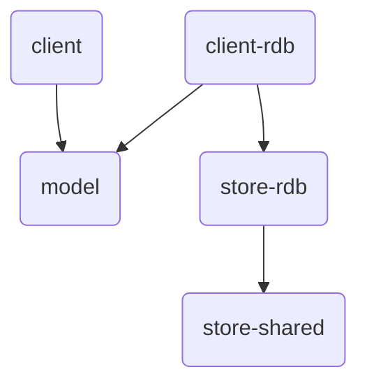

[](https://github.com/giis-uniovi/tdrules/actions)
[](https://sonarcloud.io/summary/new_code?id=my%3Atdrules)

# TdRules - Test Data Coverage Evaluation

**NOTE: Provisional content, migration to GitHub in progress...**

This repository contains a set of components to generate *Full Predicate Coverage Rules* and *SQL Mutants*
to evaluate the test coverage of database queries.
The name *TdRules* (Test Data Rules) is progressively replacing [SQLRules](https://in2test.lsi.uniovi.es/sqlrules/) 
to enable generation of rules for other data stores than relational.

## Quick Start

On Java, include the client api dependencies as indicated in Maven Central:
[tdrules-client](https://central.sonatype.com/artifact/io.github.giis-uniovi/tdrules-client)
and 
[tdrules-client-rdb](https://central.sonatype.com/artifact/io.github.giis-uniovi/tdrules-client-rdb).
A bom is also available:
[tdrules-bom](https://central.sonatype.com/artifact/io.github.giis-uniovi/tdrules-bom).

On .NET, include the `TdRules` package in you project as indicated in
[NuGet](https://www.nuget.org/packages/TdRules/)

**Example:** To generate the FPC Rules for a query `query`
that executes on a database that can be reached by an open JDBC Connection `conn`,
you first get the schema model and then the rules:

```Java
DbSchema schemaModel = new DbSchemaApi(conn).getDbSchema();
SqlRules rulesModel = new TdRulesApi().getRules(schemaModel, query, "");
```

## Description of modules

Modules currently available on Github are:

- `tdrules-bom`: The bill of materials of all TdRules components.
- `tdrules-client`: Client api to generate FPC Rules and Mutants.
- `tdrules-model`: Models of the FPC Rules, Mutants and the data store schema
- `tdrules-client-rdb`: Client api to generate the schema for relational database from a jdbc connection.
- `tdrules-store-rdb`: Core compoment for the relational database store.
- `tdrules-store-shared`: Shared components for all data stores.
- `setup`: A folder with the configuration of test database containers to use from your development environment.



## Contributing

See the general contribution policies and guidelines for *giis-uniovi* at 
[CONTRIBUTING.md](https://github.com/giis-uniovi/.github/blob/main/profile/CONTRIBUTING.md).

To set-up the test database containers in a local development environment, see the `setup` folder.

## Citing this work

FPC Rules and Mutants:
- Javier Tuya, Mª José Suárez-Cabal and Claudio de la Riva. Full predicate coverage for testing SQL database queries. Software Testing, *Verification and Reliability*, 20 (3) 237-288, September 2010.
- Javier Tuya, Mª José Suárez-Cabal, Claudio de la Riva. Mutating database queries. *Information and Software Technology*, 49(4) 398-417, April 2007.

Using the rules to generate and reduce test databases:
- J. Tuya, C. de la Riva, M.J. Suárez-Cabal, R. Blanco. Coverage-Aware Test Database Reduction. *IEEE Transactions on Software Engineering*, 42 (10) 941-959, October 2016.
- M.J. Suárez-Cabal, C. de la Riva, J. Tuya, R. Blanco. Incremental test data generation for database queries. *Automated Software Engineering*, 24(4) 719-755, December 2017.